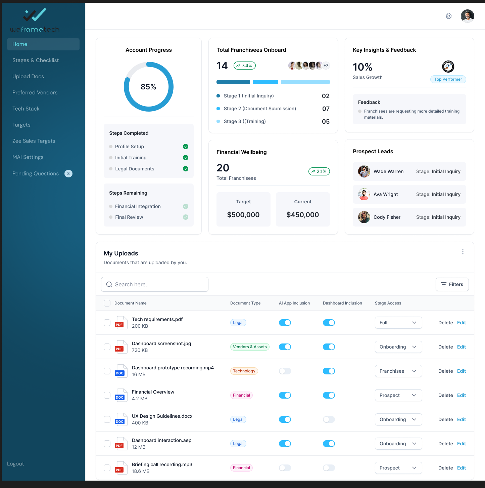

# 🚀 WeframeTech Dashboard — Assignment Scaffold  

A minimal scaffold for the **WeframeTech Dashboard Assignment**, designed to help you quickly set up, customize, and build a pixel-perfect UI.  
This project provides the base layout and structure, with flexibility to integrate `shadcn/ui` primitives and additional components as per requirements.  


## 📂 Project Structure
```bash
WeFrame_Assignment/
├── app/ # Next.js App Router pages
├── components/ # Reusable UI components
├── public/ # Static assets
├── styles/ # Global styles
└── vite.config.js # Vite configuration
```

---

## ⚡ Getting Started  

1️⃣ Clone the Repository
```bash
git clone https://github.com/<your-username>/WeFrame_Assignment.git
cd WeFrame_Assignment
```

2️⃣ Install Dependencies
```bash
npm install
```

3️⃣ Run the Development Server
```bash
npm run dev
Your app will be live at http://localhost:5173/ 🎉
```
---

## 🛠️ Setup & Integration
This scaffold comes with the basic layout. To add the full set of shadcn/ui components:
```bash
npx shadcn@latest init
```

After initialization, you can generate specific components (e.g., Button, Card, Input) by running:
```bash
npx shadcn@latest add button card input
```


## 🎯 Assignment Notes
The design requires pixel-perfect implementation.
Ensure responsive layout for desktop and mobile views.
Use shadcn/ui primitives for consistency in styling and accessibility.
Add your own polish: animations, hover effects, or custom components.

📸 Screenshots (Optional)


---
👉 This README is styled with **clear sections, emojis for readability, code blocks, and professional flow**.  

Do you want me to also add a **“Tech Stack” section** (React, Vite, Tailwind, Shadcn/UI) so it looks even more complete for GitHub?


